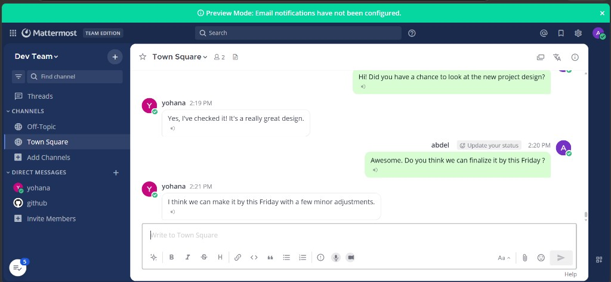
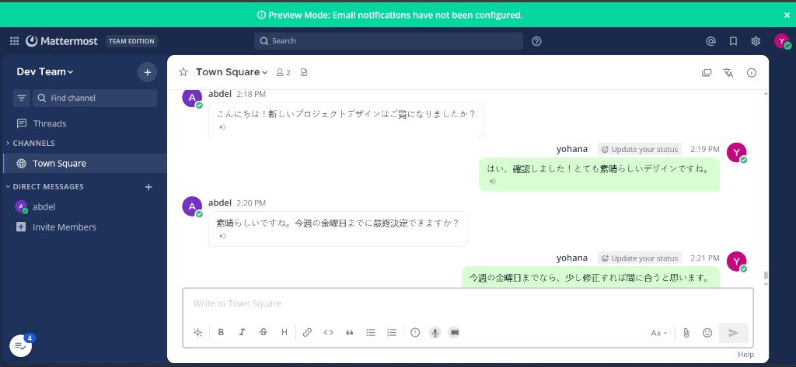
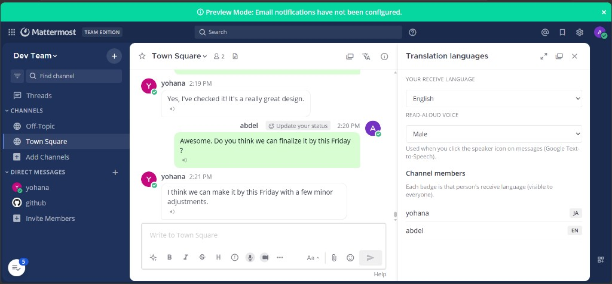
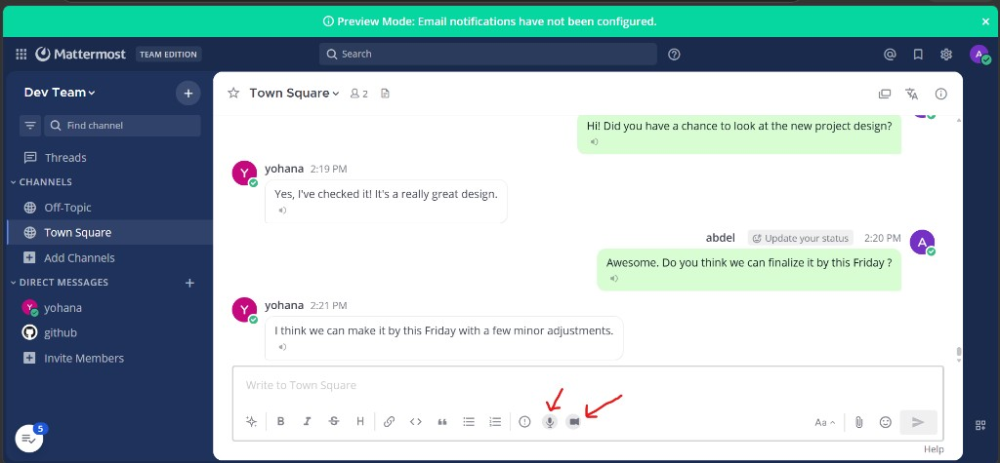
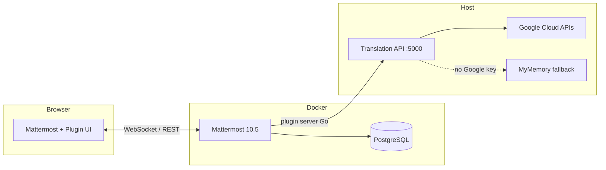

# UgaJapa Translation for Mattermost

**Real-time multilingual chat for Mattermost** — automatic per-user translation, voice & video messages, read-aloud, quality scoring, and WhatsApp-style bubbles. Built as a **Mattermost plugin** plus a standalone **Translation API** (company internship project).

| | |
|---|---|
| **Plugin ID** | `com.transchecker.translation` |
| **Plugin version** | `2.3.0` |
| **Mattermost** | Team Edition 10.5.0 (Docker) |
| **Translation API** | `http://localhost:5000` |
| **Primary engine** | Google Cloud Translation API (with MyMemory fallback) |

---

## Table of contents

- [What this project does](#what-this-project-does)
- [Screenshots](#screenshots)
- [Architecture](#architecture)
- [Quick start](#quick-start)
- [Configuration](#configuration)
- [Features](#features)
- [Translation API reference](#translation-api-reference)
- [Project structure & code map](#project-structure--code-map)
- [Documentation (Word)](#documentation-word)
- [Security notes](#security-notes)
- [Troubleshooting](#troubleshooting)

---

## What this project does

International teams can chat in **one Mattermost channel** while each person reads messages in **their own language**.

- **Abdel** writes in English → **Yohana** sees Japanese automatically.
- **Yohana** replies in Japanese → **Abdel** sees English.
- The **sender always sees their original text**; only readers get translations.
- No changes to Mattermost core — everything runs as a **plugin** + external **API**.

We did **not** clone Mattermost source code. Mattermost runs from Docker; we built a plugin on top of [Mattermost's plugin starter template](https://github.com/mattermost/mattermost-plugin-starter-template).

---

## Screenshots

### Same conversation — two languages

**English view (abdel)** — green bubbles on the right = my messages; white on the left = others.



**Japanese view (yohana)** — the same chat, automatically translated for her.



### Language settings panel

Each user picks their **receive language**. Channel members show language badges (e.g. EN, JA).



### Voice & video messages

Microphone and camera buttons in the message composer; speaker icon under each message for read-aloud (Google Text-to-Speech).



---

## Architecture



**Flow when a message is posted**

1. User sends a message → Mattermost stores the **original** text.
2. Plugin server detects new posts and each channel member's **target language**.
3. For each reader whose language differs, the plugin calls **Translation API** (`POST /translate`).
4. API uses **Google Translate** (or MyMemory), runs **back-translation quality scoring** for text, returns result.
5. Plugin pushes translation to the reader's browser via **WebSocket**; webapp renders it inline.

**Flow for voice & video messages**

1. User records audio (voice note) or video (audio track extracted) → uploaded to Mattermost.
2. Plugin sends the file to **Translation API** (`POST /transcribe`) → **Google Speech-to-Text** (Whisper fallback only if Google fails).
3. Plugin translates the transcript with **Google Translate** using a **fast media path** (one translate call — optimized for speed).
4. Reader sees translated text under the player. Same pipeline for **voice and video**.

---

## Quick start

### Prerequisites

- [Docker Desktop](https://www.docker.com/products/docker-desktop/)
- [Node.js](https://nodejs.org/) 18+
- [Go](https://go.dev/) 1.21+ (for plugin server build)
- Windows: PowerShell for `build-bundle.ps1`

### 1. Translation API

```powershell
cd translation-api
npm install
copy .env.example .env
# Edit .env — add GOOGLE_TRANSLATE_API_KEY for Google (recommended)
npm run dev
```

Verify: open [http://localhost:5000/health](http://localhost:5000/health) — expect `"translation_engine": "google-translate"` and `"google_speech_configured": true`.

Test translate:

```powershell
$headers = @{ "X-API-Key" = "dev-transchecker-key-change-in-production" }
$body = '{"text":"Hello","to":"ja"}'
Invoke-RestMethod -Uri http://localhost:5000/translate -Method POST -ContentType "application/json" -Headers $headers -Body $body
```

### 2. Mattermost (Docker)

```powershell
cd ..   # project root
docker compose up -d
```

Open **http://localhost:8065**, create admin, then:

**System Console → Plugins → Plugin Management** → Enable plugins & uploads.

### 3. Build & install plugin

```powershell
cd mattermost-plugin-translation
powershell -ExecutionPolicy Bypass -File .\scripts\build-bundle.ps1
```

Upload `dist/com.transchecker.translation-2.3.0.tar.gz` in Plugin Management. Disable/enable plugin, then **Ctrl+Shift+R** in the browser.

### 4. Plugin settings

**System Console → Plugins → TransChecker Translation**

| Setting | Local Docker value |
|---------|-------------------|
| Translation API URL | `http://host.docker.internal:5000` |
| Translation API Key | Same as `API_KEY` in `translation-api/.env` |
| Default target language | e.g. `ja`, `en`, `fr` |

---

## Configuration

### `translation-api/.env`

| Variable | Purpose |
|----------|---------|
| `PORT` | API port (default `5000`) |
| `API_KEY` | Shared secret with Mattermost plugin (`X-API-Key` header) |
| `GOOGLE_TRANSLATE_API_KEY` | Google Cloud Translation — **primary engine when set** |
| `GOOGLE_SPEECH_API_KEY` | Optional; falls back to translate key |
| `MONTHLY_CHAR_LIMIT` | Usage cap for billing prototype |
| `WHISPER_MODEL` | Local speech model if Google STT unavailable |

> **Never commit `.env` to GitHub.** Use `.env.example` as a template only.

### Google vs MyMemory

| | Google Cloud API | MyMemory |
|--|------------------|----------|
| When used | `GOOGLE_TRANSLATE_API_KEY` is set | Key missing or empty |
| Quality | Production-grade | Free fallback |
| Check | `/health` → `google-translate` | `/health` → `mymemory` |

Translations may differ slightly from [translate.google.com](https://translate.google.com) — the website and Cloud API are related but not identical. See [docs/UgaJapa-Full-Documentation.docx](docs/UgaJapa-Full-Documentation.docx) Section 12.

---

## Features

| Feature | Description |
|---------|-------------|
| **Auto-translate** | New text posts translated per reader's receive language |
| **Pre-send preview** | Popup before send when you type in a different language than your receive setting |
| **Receive language** | Per-user setting via channel header translate icon or Account Settings → Translation |
| **Manual translate** | Post ⋯ menu → Translate message |
| **Quality scoring** | Back-translation + Levenshtein + optional AI embeddings (text messages; `/translate` command) |
| **Chat slang** | Expands `bjr` → `bonjour` before translating |
| **Voice messages** | Google Speech → Google Translate → text for each reader (fast media path) |
| **Video messages** | Same as voice — audio extracted from video, then transcribe + translate |
| **Read-aloud (TTS)** | Speaker icon — Google Text-to-Speech |
| **Languages panel** | RHS panel: members + language badges |
| **WhatsApp-style UI** | Sent = green/right; received = white/left |
| **Slash commands** | `/translation-lang`, `/translate` |
| **Usage tracking** | `GET /usage` — monthly character count |

---

## Translation API reference

| Endpoint | Auth | Description |
|----------|------|-------------|
| `GET /health` | No | Status, engine name, Google configured flags |
| `POST /translate` | Yes | Translate; pass `"fast": true` for voice/video (one Google call, no back-translate) |
| `POST /detect` | Yes | Detect source language |
| `GET /languages` | Yes | Supported languages list |
| `GET /usage` | Yes | Character usage (billing prototype) |
| `POST /transcribe` | Yes | Voice/video → text |
| `POST /synthesize` | Yes | Text → speech audio |

Authenticated requests require header: `X-API-Key: <your-key>`.

---

## Project structure & code map

```
for mattermost/
├── docker-compose.yml          # Mattermost + PostgreSQL
├── README.md                   # This file
├── .gitignore
├── docs/
│   ├── UgaJapa-Full-Documentation.docx   # Full non-technical guide
│   ├── generate_full_documentation.py    # Regenerate the Word doc
│   ├── screenshots/                      # README & doc images
│   └── archive/                          # Older screenshots
├── translation-api/            # Node.js Translation API (port 5000)
└── mattermost-plugin-translation/   # Mattermost plugin
    ├── plugin.json             # Plugin manifest & settings schema
    ├── scripts/build-bundle.ps1 # Build .tar.gz for upload
    ├── server/                 # Go — runs inside Mattermost
    └── webapp/                 # React/TypeScript — runs in browser
```

### Root files

| File | Role |
|------|------|
| `docker-compose.yml` | Starts PostgreSQL 15 + Mattermost Team Edition 10.5 on port 8065; enables plugin uploads; `host.docker.internal` for API access from container |
| `.gitignore` | Excludes secrets, `node_modules`, build artifacts |

---

### `translation-api/` — Translation API service

| File | Role |
|------|------|
| `src/index.ts` | Express app: routes, API-key middleware, wires all handlers |
| `src/translate.ts` | Main translation pipeline: slang expansion, multi-candidate scoring, `fast` mode for media |
| `src/fetch_retry.ts` | Retries Google API calls on transient network errors |
| `src/google.ts` | Google Cloud Translation v2 — translate, detect, list languages |
| `src/mymemory.ts` | Free fallback translator when Google key absent |
| `src/levenshtein.ts` | Character-level similarity for back-translation score |
| `src/semantic_embeddings.ts` | Optional AI embedding similarity (Xenova/MiniLM) |
| `src/chat_slang.ts` | Expands chat abbreviations (`bjr`, `brb`, etc.) before translate |
| `src/chat_slang.test.ts` | Unit tests for slang expansion |
| `src/usage.ts` | Monthly character counting for billing prototype |
| `src/google_speech.ts` | Google Speech-to-Text for voice messages |
| `src/google_tts.ts` | Google Text-to-Speech for read-aloud |
| `src/transcribe.ts` | Audio upload → text (Google STT + local Whisper fallback) |
| `src/speech_bcp47.ts` | Language code mapping for speech/TTS |
| `.env.example` | Template for secrets (copy to `.env`) |
| `package.json` | Dependencies: express, multer, @xenova/transformers, etc. |

---

### `mattermost-plugin-translation/server/` — Plugin backend (Go)

Runs **inside** the Mattermost server process. Talks to Translation API and Mattermost APIs.

| File | Role |
|------|------|
| `main.go` | Plugin entry point |
| `plugin.go` | Core plugin lifecycle, hooks registration |
| `configuration.go` | Reads plugin settings from System Console |
| `translation_client.go` | HTTP client to Translation API (retries, fast mode for media) |
| `auto_translate.go` | Hook: auto-translate new channel posts |
| `translate_handler.go` | Manual translate, slash `/translate`, caching |
| `languages_handler.go` | User language preferences API |
| `channel_languages.go` | Per-channel member language map |
| `language_broadcast.go` | WebSocket broadcast when languages change |
| `speak_handler.go` | Read-aloud: proxy to API `/synthesize` |
| `voice_auto.go` | Voice/video STT via API, shared transcribe logic, smart language retry |
| `tts_voice_preference.go` | Male/female/neutral TTS preference |
| `api.go` | Plugin HTTP routes for webapp |
| `job.go` | Background jobs (if any scheduled tasks) |
| `command/command.go` | Slash commands (`/translation-lang`, etc.) |
| `store/kvstore/` | Key-value cache for translations |

---

### `mattermost-plugin-translation/webapp/src/` — Plugin frontend (React)

Runs in each user's **browser** inside Mattermost.

#### Core

| File | Role |
|------|------|
| `index.tsx` | Plugin registration: styles, components, hooks, post types |
| `reducer.ts` | Redux state: translations, languages, TTS gender |
| `translation_client.ts` | Calls plugin REST API from browser |
| `mattermost_api.ts` | Mattermost API helpers |
| `speak_client.ts` | Read-aloud requests |
| `post_refresh.ts` | Refresh post list after translation |

#### WhatsApp-style chat

| File | Role |
|------|------|
| `whatsapp_chat_styles.ts` | CSS: green/right sent, white/left received, bubble alignment |
| `whatsapp_chat_layout.tsx` | Tags posts as sent/received; watches DOM for new messages |

#### Translation UI

| File | Role |
|------|------|
| `components/translation_attachment.tsx` | Renders translated text under posts |
| `components/translation_attachment_wrapper.tsx` | Wrapper for attachment component |
| `components/translate_preview_modal.tsx` | Pre-send quality preview modal |
| `components/member_languages_panel.tsx` | RHS panel: languages + TTS voice |
| `components/channel_header_translate_mount.tsx` | Translate icon in channel header |
| `components/translation_header_icon.tsx` | Header icon component |
| `components/receive_language_setting.tsx` | User profile language setting |
| `components/profile_language_attribute.tsx` | Profile attribute for language |
| `components/language_select.tsx` | Language dropdown |
| `components/author_language_badge.tsx` | Badge showing author's language |
| `components/channel_language_badge.tsx` | Channel-level language badge |

#### Voice & video

| File | Role |
|------|------|
| `components/media_note_buttons.tsx` | Mic + camera in composer |
| `components/voice_note_button.tsx` | Voice record button |
| `components/video_note_button.tsx` | Video record button |
| `components/voice_note_post.tsx` | Custom post type: voice message |
| `components/video_note_post.tsx` | Custom post type: video message |
| `components/voice_note_player.tsx` | Playback UI for voice |
| `components/video_note_player.tsx` | Playback UI for video |
| `components/voice_transcript_panel.tsx` | Transcript + translate for voice |
| `components/media_transcript_panel.tsx` | Shared transcript panel |
| `components/post_speak_bar.tsx` | Speaker icon bar under text posts |
| `components/speak_button.tsx` | TTS play button |
| `voice_recorder.ts` / `video_recorder.ts` | Browser MediaRecorder logic |
| `voice_post_utils.ts` / `video_post_utils.ts` | Detect custom post types |
| `waveform_utils.ts` / `voice_player_utils.ts` | Audio waveform display |
| `media_recording_limits.ts` | 5-minute recording cap |

#### Utilities

| File | Role |
|------|------|
| `language_options.ts` / `language_labels.ts` | Language list & display names |
| `use_media_playback.ts` | Hook for audio/video playback state |
| `components/waveform_bars.tsx` | Waveform visualization |

#### Build

| Path | Role |
|------|------|
| `scripts/build-bundle.ps1` | Builds Linux plugin binary + webpack webapp → `dist/*.tar.gz` |
| `plugin.json` | Plugin metadata, min server version, settings fields |
| `webapp/webpack.config.js` | Bundles React → `webapp/dist/main.js` |

---

## Documentation (Word)

For a **complete plain-language guide** (no coding knowledge required), see:

📄 **[docs/UgaJapa-Full-Documentation.docx](docs/UgaJapa-Full-Documentation.docx)**

Includes screenshots, demo script, glossary, Google verification steps, and “how to explain this project to anyone.”

Regenerate after edits:

```powershell
python docs/generate_full_documentation.py
```

**Yes — push the document to GitHub.** It is safe to share (no secrets). Keep `.env` out of the repo.

---

## Security notes

- **Do not commit** `translation-api/.env` — it contains API keys.
- If `.env` was ever pushed, rotate your Google API key in Google Cloud Console.
- Plugin API key is configured in Mattermost System Console, not in client-side code.
- Google keys are used **server-side only** by Translation API.

Before first push:

```powershell
git rm --cached translation-api/.env
git add .gitignore translation-api/.gitignore
```

---

## Troubleshooting

| Problem | Fix |
|---------|-----|
| README looked broken on GitHub | Fixed — was corrupted trailing characters; use this README |
| Plugin can't reach API | Use `http://host.docker.internal:5000` when Mattermost is in Docker |
| `/health` shows `mymemory` | Add `GOOGLE_TRANSLATE_API_KEY` to `.env` and restart API |
| Translations not appearing | Hard refresh (Ctrl+Shift+R); check plugin enabled; check API running |
| WhatsApp layout old/wrong | Upload latest `2.3.0` bundle; disable/enable plugin; hard refresh |
| `build-bundle.ps1` fails | Install Go + Node; run from `mattermost-plugin-translation/` |
| Voice/video slow | Normal — Google STT + translate take 10–30s; v2.3.0 fast path is quicker than earlier versions |
| `translation API error: fetch failed` | Usually a brief Google/network hiccup — click **Translate to text** again; restart translation-api if it persists |
| Pre-send preview not showing | Only appears when typed language ≠ your receive language; save language in Account Settings → Translation → **Save** |
| Voice wrong language / "Already in your language" | Upload v2.3.0+; send a **new** message (old posts may have stale results) |

---

## Team & license

Built by the **UgaJapa** internship team. Mattermost is open source under its own license; this plugin and Translation API are project deliverables for the company integration assignment.

---

<p align="center">
  <strong>UgaJapa Translation for Mattermost</strong> · v2.3.0 · June 2026
</p>
